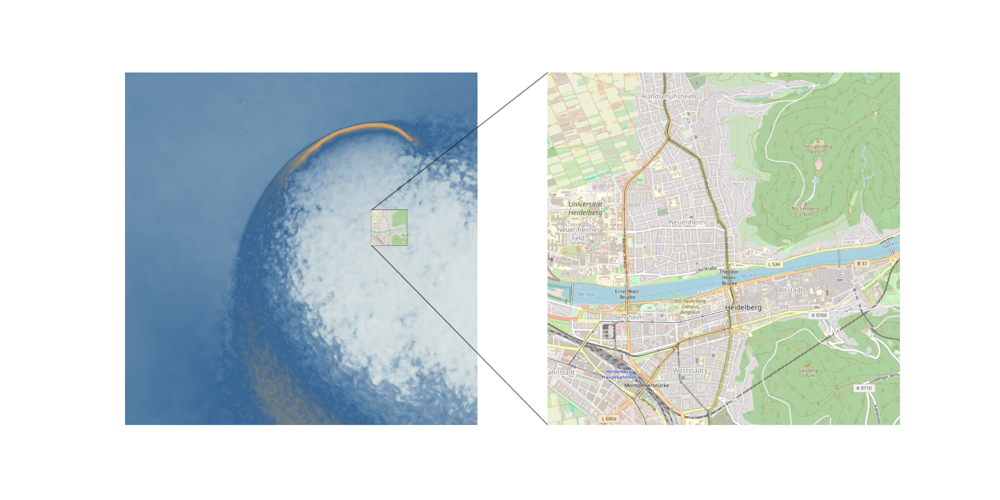

## Introduction

Type IaSN are not only one of the brightest transients in the Universe, but they are also crucial for many aspects  of astrophysics, ranging from nuclear physics and nuclosynthesis all the way to cosmology (they are one of the most useful methods for measuring the expansion of the Universe).

It is believed that SNIa are the result of a thermonuclear runaway burning inside of carbon-oxygen white dwarfs (COWD), although the exact mechanism preceding the explosion is still debated.
One of the most promising scenarios is the 'double-detonation' mechanism. 
This mechanism works due to the fact that COWDs can have a thin helium layer siting on top of their surface.
Helium is ignites at densities and temperatures substantially below the ones required to ignite the CO material deep inside the WD.
If a He ignition is achieved on the COWD surface, the detonation can send shocks inside the WD, as the helium is burnt around it, and the convergence of this shocks inside the WD can heat and compress the CO material to trigger a second detonation, much more energetic, that will propagate outwards, incinerating the material and completely unbinding the WD, giving rise to a Type Ia SN.

## Numerical challenges

3D simulations are the most accurate method to model complex phenomena, but they are increasingly expensive. Simulations in 3D of double detonations exists (e.g. [Pakmor2022](https://ui.adsabs.harvard.edu/abs/2022MNRAS.517.5260P/abstract), [Pakmor2021](https://ui.adsabs.harvard.edu/abs/2021MNRAS.503.4734P/abstract)) but they cannot resolve the nuclear ignitions. That is, the ignition takes place in (at best) a couple of grid cells, and could be the result of numerical artifacts. 
In these studies, the conditions found in these cells are compared to those in 1D simulations of resolved ignitions, to check that the explosions can actually take place under the observed temperatures, densities and nuclear compositions and asses the reliability of the simulation results.
The main challenge in order to resolve these ignitions is that of scale: under the thermodynamical conditions found in WDs, resolving a helium detonation requires resolving scales down to hundreds of meters, and a carbon detonation takes place at scales of centimeters.
Resolving such scales in simulations where you are also resolving stellar sized objects sounds plainly unreasonable.

But the advances in numerical tools are giving us a fighting chance. The AREPO code, allows for an incredibly flexible refinement of the grid. This has enabled me to take one of my double-detonation simulations, and locally increase the resolution (following the material in the Helium layer where the ignition is located) down to cell-sizes of 70 meters.
This has resulted in the first-ever simulation in 3D of a resolved helium ignition is a global simulation.

The magnitude of scales that this simulation covers is better appreciated in the following video:



\
\
\
\
For reference, this is how the close-up looks like compared to the beautiful city of Heidelberg

 {height = 1000px}


